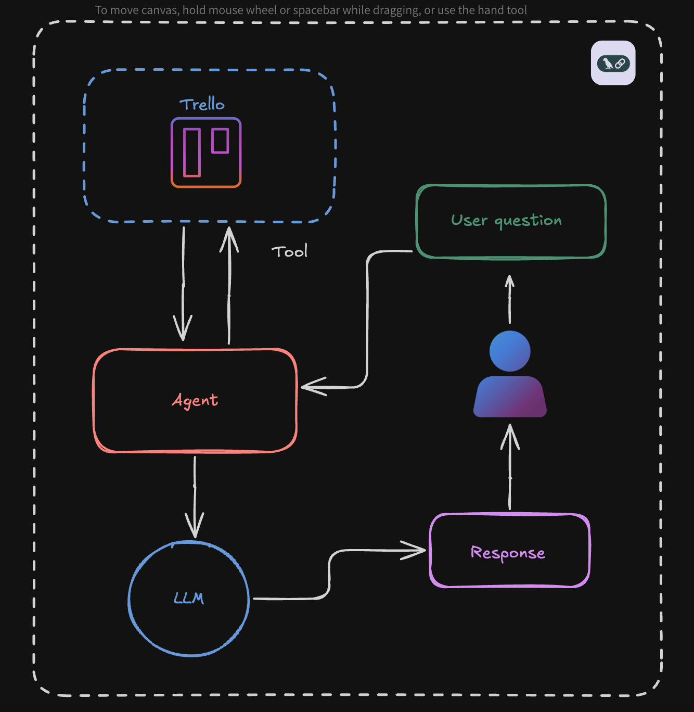

# AI-Support-Chain 🤖 ⛓️

AI-Support-Chain is a tool that spots recurring issues in user queries. It uses AI to detect patterns in support requests and prioritize frequent problems, making it easier to manage and resolve common issues.

## Technologies Used

| Technology    | Icon                                                                                          | Description                                                                                             |
| ------------- | --------------------------------------------------------------------------------------------- | ------------------------------------------------------------------------------------------------------- |
| **NestJS**    |                 | A progressive Node.js framework for building efficient and scalable server-side applications.            |
| **OpenAI API**|             | Utilized for natural language processing and identifying patterns in support tickets.                    |
| **TypeScript**|  | Provides strong typing and modern JavaScript features.                                                   |
| **Docker**    |    | Ensures easy deployment and consistent environments across different stages of development.              |

## Technical Overview

1. Architecture



## Getting Started

1. Clone the repository:

```
   git clone 
```

2. Install dependencies:

```
 npm install
```

3. Run the Docker container:
  
  ```
  docker-compose up
  ```

## Running the app

```bash
npm start
```

The app will be accessible at `http://localhost:3000` 🚀 

## Support

Nest is an MIT-licensed open source project. It can grow thanks to the sponsors and support by the amazing backers. If you'd like to join them, please [read more here](https://docs.nestjs.com/support).

## License

Nest is [MIT licensed](LICENSE).
